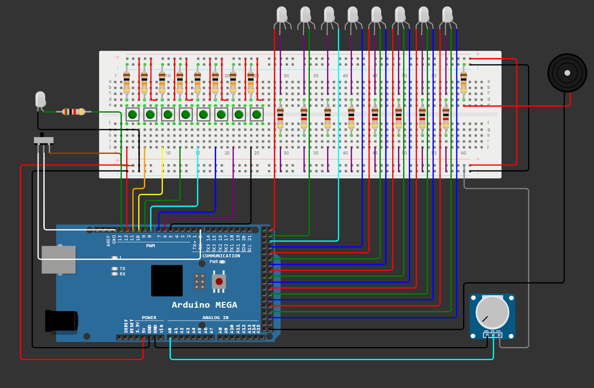
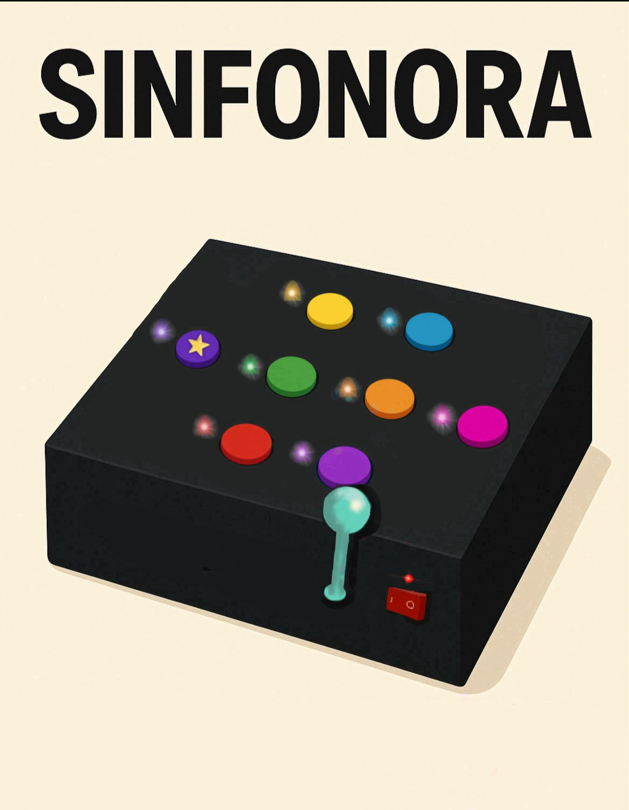

# SINFONORA

**Jogo interativo desenvolvido em Arduino.**

Este projeto é um jogo intuitivo criado para **auxiliar no tratamento e na convivência de pessoas com déficit de memória e dificuldades no armazenamento de informações**. Ele foi idealizado com o objetivo de ser inclusivo, divertido e de fácil acesso, tanto para os usuários quanto para os desenvolvedores.

## Sobre o Jogo

Criado como parte de um projeto da disciplina de Projeto 1 da faculdade CESAR School, este jogo traz uma experiência divertida utilizando recursos básicos de Arduino. A ideia é que o jogador, _por meio de estímulos sonoros, visuais e cognitivos_, exercite áreas mentais específicas. O jogo pode ser utilizado como instrumento terapêutico para auxiliar no tratamento de doenças relacionadas à memória.

A componente musical desempenha papel fundamental no desenvolvimento do jogo, pois as sequências sonoras são utilizadas como estímulos auditivos que promovem a memorização e o reconhecimento de padrões, potencializando a interação do jogador e favorecendo o engajamento cognitivo por meio da música.

## Circuito

O circuito deste projeto utiliza os seguintes componentes: **LEDs RGB, buzzer, Arduino Mega, potenciômetro, botões e resistores**. Devido à complexidade das conexões envolvidas, recomenda-se a consulta ao diagrama esquemático para compreender a disposição e a ligação dos componentes.

## Layout

Abaixo está o layout do Sinfonora, com foco em uma interface visual limpa, uso estratégico de cores e elementos posicionados para facilitar a interatividade e adaptação do jogador ao desafio proposto.

## Código

O código deste projeto foi desenvolvido para controlar a lógica do jogo utilizando os recursos disponíveis no Arduino Mega. Ele é responsável por:

- Gerenciar a interação entre os botões, LEDs RGB e buzzer;
- Controlar as sequências de estímulos visuais e sonoros;
- Armazenar e validar a resposta do jogador;
- Fornecer feedbacks corretos ou incorretos com base na entrada do usuário.

Além disso, o programa está organizado em funções que separam a lógica principal (loop) dos comportamentos específicos (como geração de sequência, leitura de entrada e reprodução de sinais).

## Como Jogar

O Sinfonora é um jogo dinâmico, criativo e **versátil**, projetado para se adaptar a diferentes estilos de jogadores e situações. Seu grande diferencial está na amplitude de modos de jogo, permitindo que a diversão aconteça de maneira individual, em duplas ou em grupo. A dinâmica acontece da seguinte forma:

1. **Início da Sequência**: Um jogador inicia o turno pressionando um botão. Ao finalizar, ele deve pressionar o **botão TUDO** para registrar a sequência no sistema.

2. **Repetição da Sequência**: O próximo jogador deve repetir fielmente a sequência anterior, pressionando os mesmos botões na mesma ordem. Ao concluir, ele também pressiona o **botão TUDO** para que a sequência seja verificada.

3. **Acerto da Sequência**: Se a sequência estiver correta, os LEDs exibirão um efeito visual de sucesso. O jogador, então, deverá acrescentar uma nova nota à sequência antes de pressionar novamente o **botão TUDO** para passar ao próximo participante.

4. **Erro na Sequência**: Caso o jogador erre a sequência, o **botão TUDO** permanecerá aceso e será emitido um som de “game over”, indicando que a tentativa foi mal sucedida.

5. **Reinício do Jogo**: Para reiniciar o jogo, o participante deve girar completamente a alavanca (potenciômetro) para a posição mais baixa e, em seguida, retornar à posição mais alta. Isso sinaliza ao sistema que um novo jogo deve ser iniciado.

## Considerações Finais

Este projeto demonstrou como é possível combinar elementos visuais, sonoros e interativos utilizando o Arduino para criar uma experiência lúdica e funcional. A aplicação de componentes como LEDs RGB, buzzer, potenciômetro e botões permitiu explorar conceitos de lógica, eletrônica e estímulo cognitivo. Além do aspecto recreativo, **o jogo possui potencial terapêutico**, especialmente no apoio ao desenvolvimento e à recuperação da memória por meio da música e da repetição de padrões. Espera-se que este trabalho sirva como base para futuras melhorias e novas aplicações educacionais ou clínicas.

Para mais informações acesse o site: [Sinfonora](https://sites.google.com/d/1ygwbbKgm3zDAxUh_W93Q2j5mMoXxOYxv/p/1SqBYmieTN5u5bkHMTLn3uDx4JpNuPtCH/edit)
