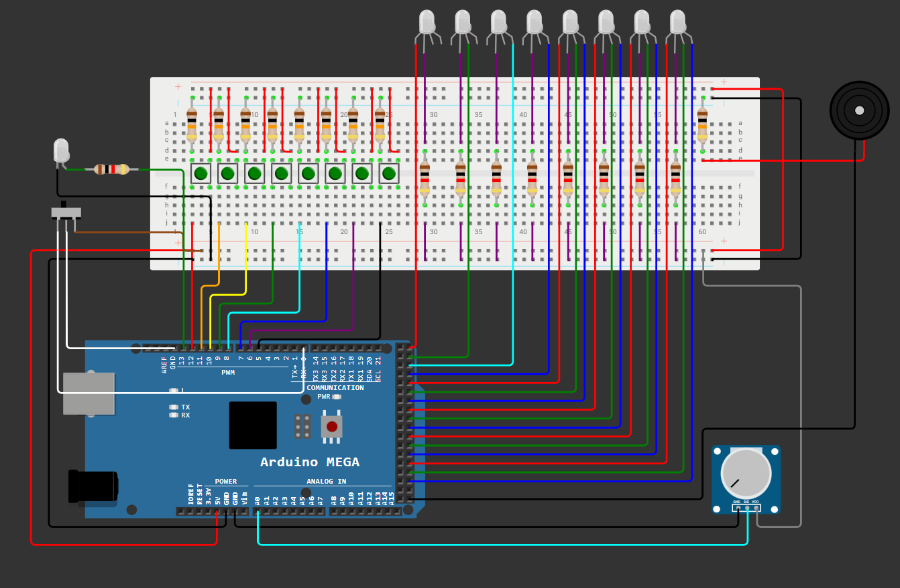
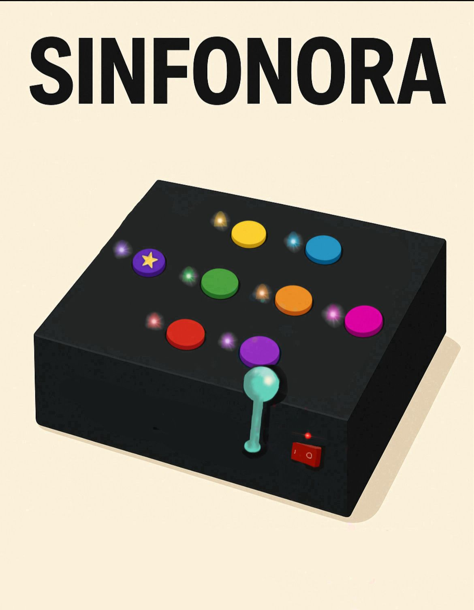
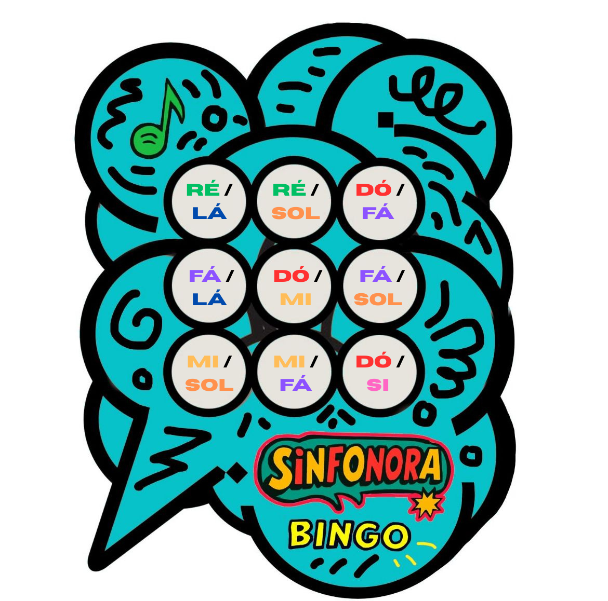

# Sinfonora

Jogo interativo desenvolvido em Arduino.

Este projeto é um jogo intuitivo criado para auxiliar no tratamento e na convivência de pessoas com déficit de memória e dificuldades no armazenamento de informações. Ele foi idealizado com o objetivo de ser inclusivo, divertido e de fácil acesso, tanto para os usuários quanto para os desenvolvedores.

## Sobre o Jogo

Criado como parte de um projeto da disciplina de Projeto 1 da faculdade CESAR School, este jogo traz uma experiência divertida utilizando recursos básicos de Arduino. A ideia é que o jogador, por meio de estímulos sonoros, visuais e cognitivos, exercite áreas mentais específicas. O jogo pode ser utilizado como instrumento terapêutico para auxiliar no tratamento de doenças relacionadas à memória.

A componente musical desempenha papel fundamental no desenvolvimento do jogo, pois as sequências sonoras são utilizadas como estímulos auditivos que promovem a memorização e o reconhecimento de padrões, potencializando a interação do jogador e favorecendo o engajamento cognitivo por meio da música.

## Circuito

O circuito deste projeto utiliza os seguintes componentes: LEDs RGB, buzzer, Arduino Mega, potenciômetro, botões e resistores. Devido à complexidade das conexões envolvidas, recomenda-se a consulta ao diagrama esquemático para compreender a disposição e a ligação dos componentes.

## Layout

Abaixo está o layout do Sinfonora, com foco em uma interface visual limpa, uso estratégico de cores e elementos posicionados para facilitar a interatividade e adaptação do jogador ao desafio proposto.

## Código

O código deste projeto foi desenvolvido para controlar a lógica do jogo utilizando os recursos disponíveis no Arduino Mega. Ele é responsável por:

- Gerenciar a interação entre os botões, LEDs RGB e buzzer;
- Controlar as sequências de estímulos visuais e sonoros;
- Armazenar e validar a resposta do jogador;
- Fornecer feedbacks corretos ou incorretos com base na entrada do usuário.

Além disso, o programa está organizado em funções que separam a lógica principal (loop) dos comportamentos específicos (como geração de sequência, leitura de entrada e reprodução de sinais).

## Como Jogar

O Sinfonora possui dois modos de jogo: Sequência de Notas e Bingo Musical. A alteração entre os modos é feita por meio da alavanca na lateral do dispositivo, que deve ser posicionada para cima para o modo Bingo e para baixo para o modo Sequência de Notas.

### Modo 1 : Sequência de Notas

#### Objetivo

Memorizar e repetir corretamente a sequência de sons (notas) emitidas ao longo das rodadas.

#### Instruções

1. O jogador 1 pressiona um botão, o som da nota toca;

2. O jogador 2 repete a nota anterior e adiciona uma nova pressionando um botão;

3. O jogador 3 repete a sequência de dois sons e adiciona mais um... e assim por diante;

4. O sistema compara a sequência:
    - Correta: o jogo continua.
    - Incorreta: som de erro, jogador eliminado.

5. O último jogador restante vence, toca a melodia da vitória;

6. Skip de jogador:
    - Usar o Botão Tudo (com uma estrela no topo) para pular um jogador ou rodada se necessário. É indicado que cada jogador utilize o skip uma vez por rodada.

### Modo 2: Bingo Musical

#### Objetivo

Ouvir as notas tocadas, podendo fazer associação visual ou sonora, e marcar as duplas correspondentes na cartela até completar uma linha, coluna ou diagonal.

#### Instruções

1. Organizador inicia o jogo, o buzzer toca a dupla de notas;

2. Os jogadores procuram a combinação na cartela física e marcam;

3. Ao completar linha, coluna ou diagonal:
    - O jogador grita “BINGO!” e pressiona o Botão Tudo, ele irá repetir toda a sequência.

4. O Organizador confere manualmente a cartela:
    - Dando 3 toques seguidos no Botão Tudo o orientador conseguirá conferir a cartela manualmente.
    - Caso esteja correto, a melodia da vitória toca.

#### Cartelas Físicas do Bingo

#### Observação

Não há narrações de notas, o jogo depende da audição e atenção do jogador.

### Funcinalidades do Botão Tudo

O Botão Tudo é um componente essencial para a interação do jogador, permitindo o controle direto das ações no jogo. Sua resposta rápida e confiável garante o funcionamento eficiente das dinâmicas do sistema.

| Ação | Como Fazer | Som Emitido | Função | Modo de Jogo |
|------|------------|-------------|--------|--------------|
| Reiniciar jogo | Toque longo (2 segundos) | Som grave contínuo (“buuuum”)| Reinicia sistema e apaga sequência atual | Sequência de Notas e Bingo Musical|
| Repetir sequência | Dois toques rápidos | “bip-bip” (médio) | Repete a última dupla de notas | Bingo Musical |
| Pular rodada/jogador | Toque curto simples | Bip agudo |Ignora jogador atual | Sequência de Notas |
| Avançar nota | Toque curto simples | Bip médio | Toca nova dupla de notas | Bingo Musical |
| Confirmar “BINGO!” | Três toques seguidos | Melodia curta festiva | Sinaliza “BINGO!” ao organizador | Bingo Musical|

## Considerações Finais

Este projeto demonstrou como é possível combinar elementos visuais, sonoros e interativos utilizando o Arduino para criar uma experiência lúdica e funcional. A aplicação de componentes como LEDs RGB, buzzer, potenciômetro e botões permitiu explorar conceitos de lógica, eletrônica e estímulo cognitivo. Além do aspecto recreativo, o jogo possui potencial terapêutico, especialmente no apoio ao desenvolvimento e à recuperação da memória por meio da música e da repetição de padrões. Espera-se que este trabalho sirva como base para futuras melhorias e novas aplicações educacionais ou clínicas.

Para mais informações acesse o site: [Sinfonora](https://sites.google.com/d/1ygwbbKgm3zDAxUh_W93Q2j5mMoXxOYxv/p/1SqBYmieTN5u5bkHMTLn3uDx4JpNuPtCH/edit)